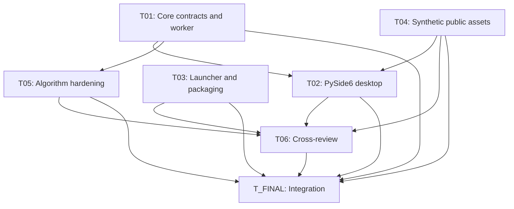

# Dependency Graph

## Parallel Launch Groups

| Group | Can Start | Must Wait For |
| --- | --- | --- |
| A | T01, T03, T04, T05 | None; T05 records contract requests for T01/T_FINAL |
| B | T02 | T01 and T04 handoffs |
| C | T06 | T02–T05 handoffs and smoke results |
| D | T_FINAL | All Txx handoffs and smoke results |
